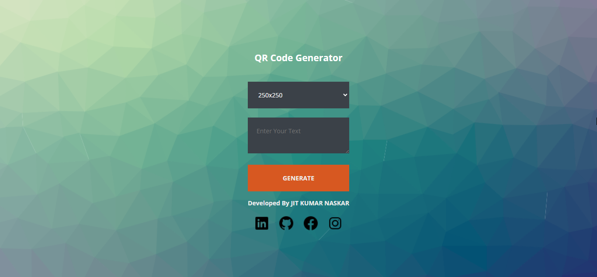
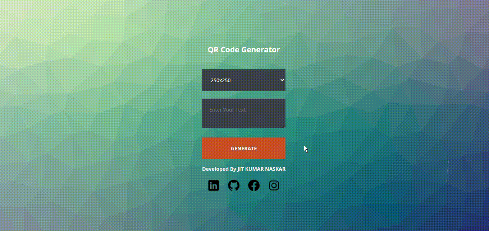

<h1 align="center" id="title"> QR Code Generator </h1>

<div align="center">


 A simple web-based QR code generator that allows you to generate QR codes with custom text and size.
 
  <p>Generate your QR Code today! Visit my website <a href="https://jitkrnaskar.github.io/QR-Code-Generator/">here</a></p>
</div>

## Features
- The application offers a user-friendly and visually appealing interface, ensuring an engaging and intuitive user experience.
- Generate QR codes with custom text and size.
- Choose from multiple sizes for the generated QR code.


## Built with

<p align="center">
  <a href=#></a>
</p>

- **HTML/CSS**: The user interface of the application is designed using modern HTML and CSS techniques, ensuring an appealing and intuitive design.

- **JavaScript**: The functionality of the QR code generator is implemented using JavaScript to handle user inputs, generate QR codes, and manipulate the DOM.

- **Git**: The project utilizes Git for version control and collaboration during the development process.


## Preview




## Getting Started

### Prerequisites

- Web browser (Chrome, Firefox, Safari, etc.)

### Installation

1. Clone the repository:

  ```console
   git clone https://github.com/JitKrNaskar/qr-code-generator.git
   ```

2. Open the [index.html](https://github.com/JitKrNaskar/QR-Code-Generator/blob/main/index.html) file in your preferred web browser.

## Usage

1. Enter the desired text in the text area.
2. Select the size of the QR code from the dropdown menu.
3. Click the "Generate" button to generate the QR code.
4. The generated QR code will be displayed below the input fields.




## License

This project is licensed under the [MIT License](https://github.com/JitKrNaskar/QR-Code-Generator/blob/main/LICENSE).

## Acknowledgments

- [Flaticon](https://www.flaticon.com/) for the social media icons.
- [Cool Backgrounds](https://coolbackgrounds.io/) for the background image.


## Contact

For any inquiries or questions, please feel free to contact me:

[](https://www.linkedin.com/in/jitkumarnaskar/)
[](https://github.com/JitKrNaskar)
---
